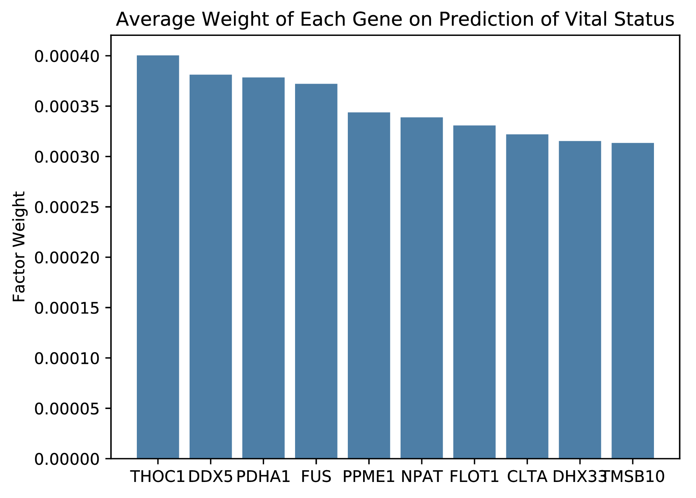
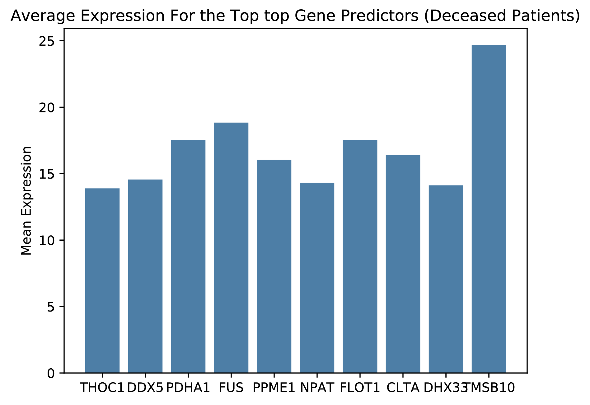
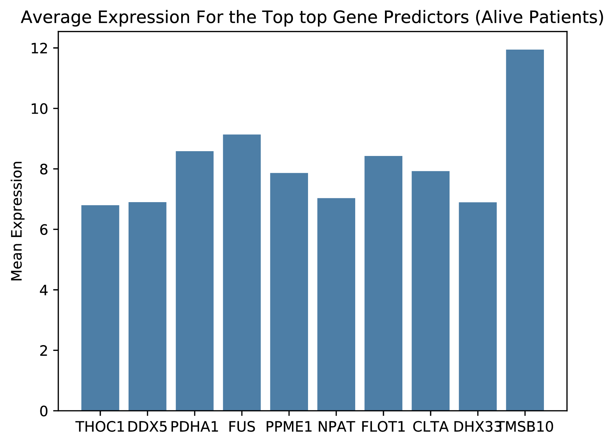
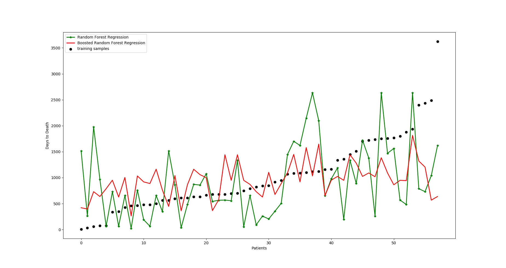

# Report 7/1/19 by Fenn Napier

## About the Project

For the first month of research we focused ondata collection and clean up. We originally tried to use MethylMix, a collection of prexistsing data libraries that would give us both mehtylation and gene expression values for cancer and non cancer patients. Starting with ovarian cancer we tried to check for methelations and its relation to gene expression diffrences between cancer and normal genetics however we found very little. We believe this to be due to a small sample size so we tried to move on to COAD, a colon cancer with a larger sample size and a specifc focus of our collaborator Dr.Conrad. After multiple failues of the overnight downloads required we had to shift gears and looked for other sources of data. FireBrowse was the next publicly available cancer grouped gene data set we could get our hands on. From this we were able to get another ovarian cancer data set with more predictors then available from MethylMix alone. We were able to preform machine learning on this data set

## What we have done

1) Collect gene expression for patients having ovarian cancer from [FireBrowse](http://firebrowse.org/) and [MethylMix](https://academic.oup.com/bioinformatics/article/34/17/3044/4970512)

2) After partitioning the data by vital status we tested multiple machine learning algorithims to predict if the patient would live or die : 
    * Accuracy of Random Forest is : 52%
    * Accuracy of Decision Tree is : 27%
    * Accuracy of Support Vector Classification is : 51%
    * Accuracy of Logistical Regression is : 50%

    This is a graph of the weights that the random forest algorithm assinged to each gene. Each weight value represents how important the gene is for the prediction. Below is the top 10 genes out of 17853 genes used.

   

    We then looked at the deceased patients to check for the average expression of these genes to compare to those who were still alive

    
    

    These figures show a noticible increase in expression of the predictor genes in the deceased patient sample pool.

3) Next up was to get the machine to predict how many days the patient lived for while under treatment. Visualizing the results form a Regression Tree showed us they were less accurate than hoped.

    

## What we plan to do

Since the Regression Tree is not very accurate we plan to seperate the patients into quintiles based on days lived under treatment and then have the machine predict which quintile the patient is in. After the initial run to check for accuracy we will isolate the predictors most important for each quintile. The issue with this is we would halve our current sample size to around 250 because a little over half our patients lived. We plan to continue to see what results we will get but then move on to a diffrent data set with more patients. Currently we are looking at the FireBrowse kindney cancer data set which has a patient pool of around 890 patients. 