# dna-code  
The first question we asked this summer was is it possible to predict gene expression through methylation of that same gene. Methylation is a chemical modification of the DNA which effects how the gene is read without changing the specific sequence of the gene. The reading and translation of the gene from genetic code into proteins can be measured in RNA abundance. RNA is only produced if the gene is to be turned into a protein. The biological core behind our question was that methylation, if it’s on a gene promotor site, can inhibit gene expression.
We followed this up with a question of predicting patient survival through methylation, gene expression, and various clinical data. We tried to predict several different types of patient's survival: (1) Binary, did the patient live or die; (2) Nonbinary, how many days did the patient survive; and (3) Quintile predictions, which quintile of life expectancy the patient fell into. Using the listed data we should be able to predict severity of the cancer and the overall health of the patient allowing us to predict survival status.

## <strong>Installs</strong>

Dependencies are numpy, sklearn, pandas, and scipy. 

## <strong>Data Set Locations</strong>
All Data files are stored in pkl file format in npy compressed files in a dir called Pickles seprated by cancer type. 
### <strong>Ovarian Cancer Data</strong>

Go to dna-code/R/methyl_data.R  Make sure the Cancer sight variable is called 'OV' and then run the file. It will download 4 files you need, two files for both cancer and control. This data was used for proof of concept but was later replaced with data down below

[FireBrowse](http://firebrowse.org/)
Select Ovarian Serous Cystadenocarcinoma for the Select Cohort drop down menu and then click on the mRNA data. Also download the clinica data of the patients. Match Patient ID's to remove patients not included in both

### <strong>Colon Cancer Data</strong>

Go to dna-code/R/methyl_data.R  Make sure the Cancer sight variable is called 'COAD' and then run the file. It will download 4 files you need, two files for both cancer and control. This data was used for proof of concept but was later replaced with data down below

[FireBrowse](http://firebrowse.org/)
Select Colon Adenocarcinoma (COAD) for the drop down menu. Dowload both clinical and mRNA seq data. Match patient ID's and remove those not in both.

### <strong>Kidney Cancer Data</strong>

[FireBrowse](http://firebrowse.org/)
Select Pan-Kidney cohort (KIPAN) for the drop down menu. Download both clinical and mRNA seq data. Match patient ID's and remove patients not in both.

### <strong>Lung Adenocarcinoma Paper Replication Data</strong>

Go to dna-code/R/methyl_data.R  Make sure the Cancer sight variable is called 'LUAD' and then run the file. It will download 4 files you need, two files for both cancer and control. This data was used for proof of concept but was later replaced with data down below

[The Papers Linked Git Hub](https://github.com/lanagarmire/epiPredictor) has some code we used and heavily modifed. After we got a working model we used the Methyl Mix Data in our Model instead of using their data.

## <strong>Files to Run</strong>

Prediction Files are labled as Classifiers with each file having a naming convention to stait what it predicts. The classifer to predict life and death in patients is ClassifierBinary.py, this extends to all cancers.

The output of all classifier files is in the format below and repeats for every predition algorithm conigured to work for that cancer type. Code is commented so feel free to take a look.   
>"Prediction of model: [Array of 0s and 1s]"  
"Actual Data : [Array of 0s and 1s]"  
"Accuracy of (Prediction Algorithm Name) : %"

## <strong> Head and Neck Cancer Data Sets</strong>
The data set was pulled from the [Head and Neck Squamous Cell Carcinoma TCGA PanCancer data](https://www.cbioportal.org/study/summary?id=hnsc_tcga_pan_can_atlas_2018). The original data is at from the cBioPortal HNSC data set sourced from the Pan Cancer Atlas. The first problem occurred when we found out that this data set is ever changing. The source paper provided a Clinical data file however. From this clinical data file I was able to pull patient ID codes and use that to filter out this data set. This left me with a total of 504 patients, a number that matched the papers. With the original patient list obtained I Then needed to clean the data in accordance with the paper. First step was to use the DEseq2 R package to normalize the data set. Then I needed to prune for outliers by using the DEseq2 package at a |log2 fold|>1 change. After this we were left with 477 samples.

## <strong>Explanation</strong>

### <strong>Replication with Lung Adenocarcinoma</strong> 
We replicated the paper “Using epigenomics data to predict gene expression in lung cancer, Li, Ching, Huang, Garmire”, which predicted if a gene was activated or not using methylation data. First was to replicate a cross correlation matrix of their sixty-seven top features. The features are the different genes, histones, and methylation for each patient. The paper itself  already ran a feature selection that we replicated as seen below. This is used to show which features should be used for the prediction.

>Li J, Ching T, Huang S, Garmire LX. Using epigenomics data to predict gene expression in lung cancer. BMC Bioinformatics. 2015;16 Suppl 5(Suppl 5):S10. doi:10.1186/1471-2105-16-S5-S10
[Link](https://www.ncbi.nlm.nih.gov/pmc/articles/PMC4402699/)

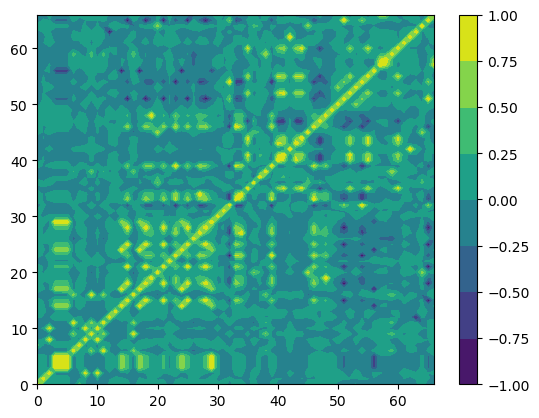
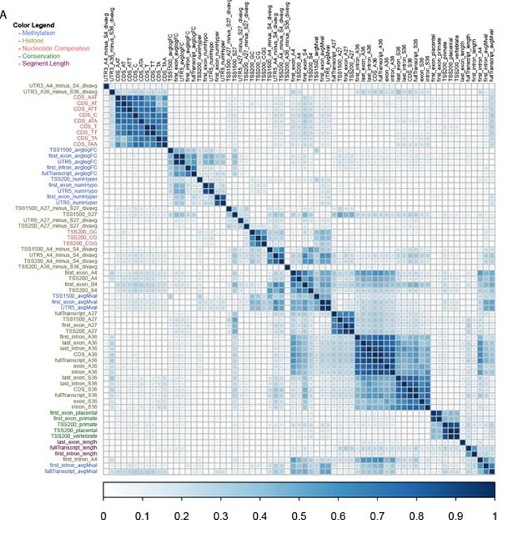
Although inverted, we were able to successfully replicate the matrix, next step was to get a similar accuracy score. Using these 67 features we were able to predict the survival of a patient in the case of lung cancer. Ours results (see table below) match the accuracy of the article which is around 75%-78%. 
Lung Cancer (LUAD): prediction of increase or decrease in Gene Expression
|Method| Accuracy 
|---|--- 
|Random Forest LUAD| 75.5%     
|Trees LUAD| 61.1%     
|Support Vector Classification LUAD| 54.3%   
|Logistical Regression LUAD| 60.6%   
|Multi-Level Perceptron LUAD| 54.5%   
|Choosing Always Alive| 54.1%  
|Choosing at Random| 51.5%
 

500 Steps of Monty Carlo Simulation for Random Forest and Uniform Distribution
Remark: The Random Forest showed a mean accuracy of 75.5% which is greater than choosing randomly at 51.5%. We were able to predict if a gene was activated or not.
We also put their data through a neural network to see if it would be better at classifying the patient. The neural network had a significantly worse and more varying accuracy of around 50% at worst and 60% at best.

### 3.3 Experiments with Ovarian Cancer
Ovarian Cancer (OV): prediction of days to death separated into quintiles    

|Method | Accuracy |  
|----|-----|  
|Quintile Random Forest OV|21.3%|     
|Quintile Trees OV|14.6% |  
|Quintile Support Vector Classification OV| 18.3%   
|Quintile Logistical Regression OV|20%    
|Choosing Always Quintile |20%  
|Choosing at Random |21.7%

Remark: The Random Forest algorithm, which is our most accurate one at 21.3%, is not as accurate as choosing randomly at 21.7%.
We later tested our algorithms onto Colon adenocarcinoma (COAD). The main issue was that we had a large amount of missing clinical data, like treatment type and age of patient, that were previously a heavily influential predictor. COAD, however, had 22 % above chance accuracy for binary Random Forest prediction and binary Logistical Regression in some cases.

### 3.4 Application of model to Colon Adenocarcinoma

Colon Cancer (COAD): prediction between deceased or alive  
|Method|Accuracy|
|---|---|
|Binary Random Forest COAD|  72%      
|Binary Trees COAD| 55.1%   
|Binary Support Vector Classification COAD| 58.6%    
|Binary Logistical Regression COAD |62%      
|Choosing Always Alive | 58.6%   
|Choosing at Random | 50.4%

Remark: The Random Forest to predict life or death was has a mean accuracy of 72%, the Logistical Regression has a mean accuracy of 62%. Both are more accurate then choosing randomly which has a mean accuracy of 50.4%

 COAD quickly became the focus of our work. We, then, try to see which gene was the most important for predicting life or death. We ran a principal component analysis on the COAD data set. Below is the PCA results with all alive patients in blue and dead patients in red. 

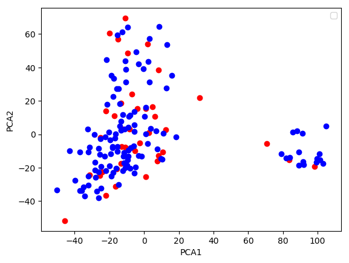
This was the only significant separation in the PCA. The PCA was not grouped on survival of the patient and so to further narrow down what exactly was separated we ran a LOD analysis to see which genes were the most important. 

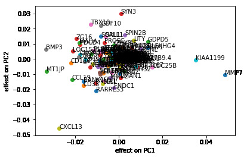
The genes on the far left were the most important and they were linked to a wide variety of genes with individually distinct purposes, none of which relate to COAD cancer. 

## Paper 2

### <strong>Data Set Managment</strong>
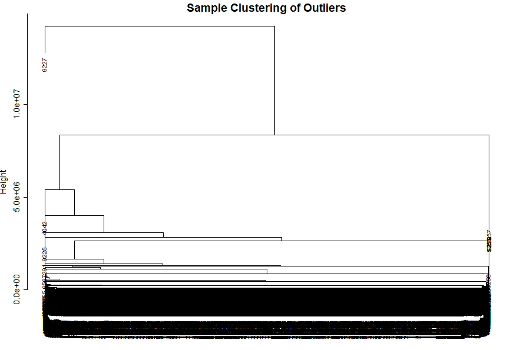
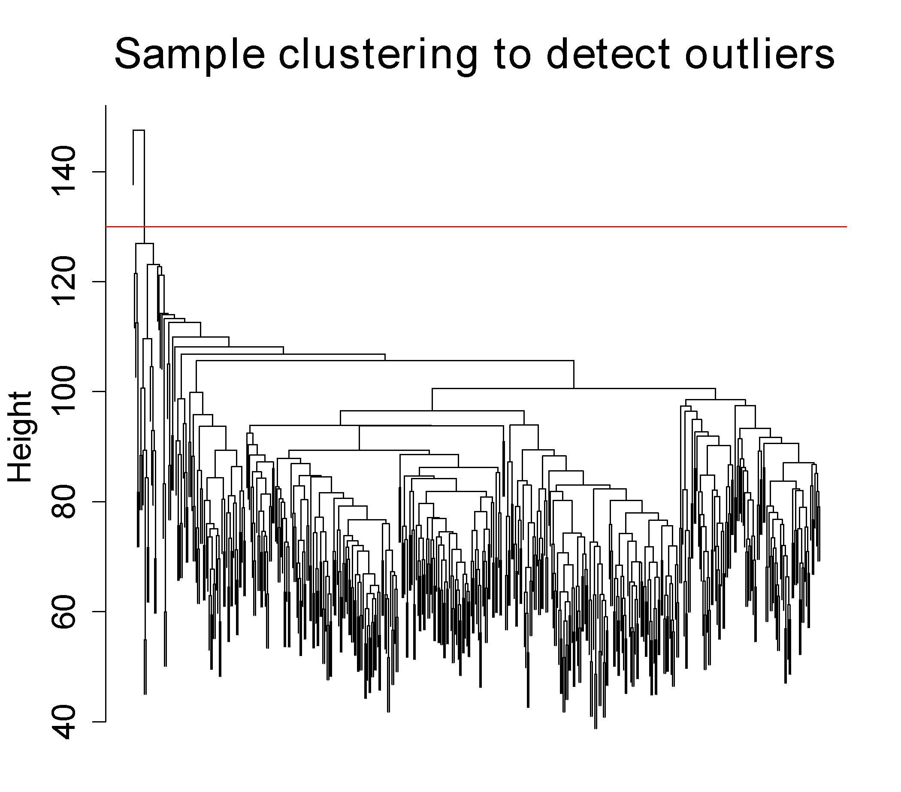
Above is two images of the Sample Clustering diagrams. The first image is the one we obtained and the second is the one provided by the paper. Although the mesures are seprate the patters and outliers listed are the same. 

### 4 WCGNA hub gene analysis
The next step was the replication of the WCGNA hub gene analysis. This was preformed using the WCGNA module in R. The package is listed under both R Biomanager and in a standalone version. The paper does not specify which one used however from what I have found they should be the same package with different sources, I was unable to confirm they were both the same version. I used the stand-alone version for replication. WCGNA package was applied to the dataset with β = 4 (scale free R­2 = 0.93). 
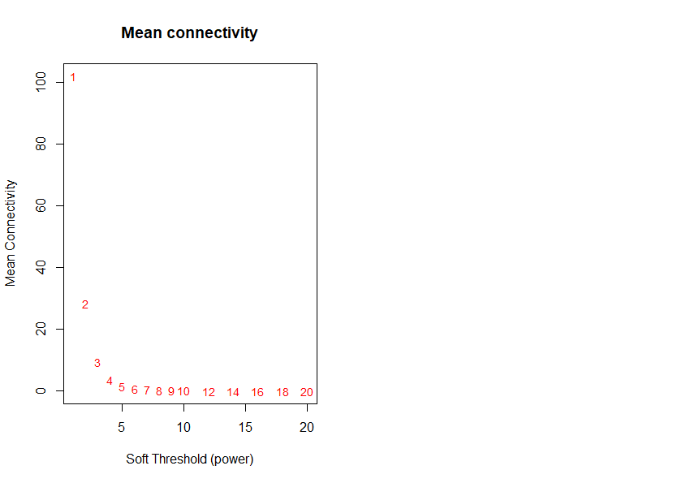
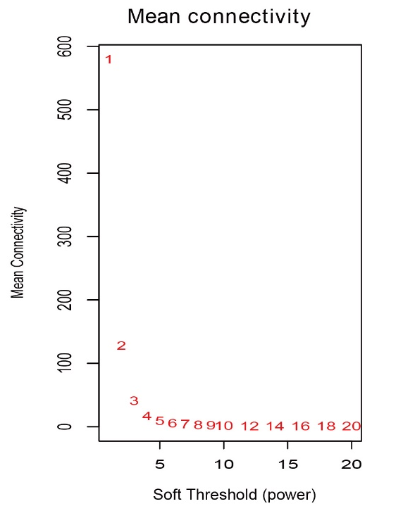

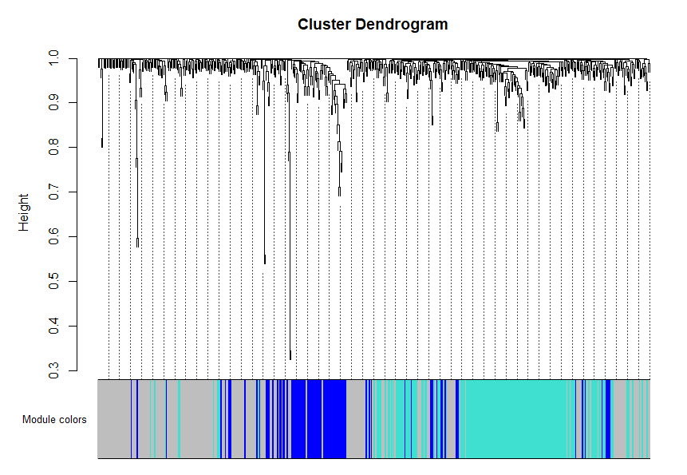
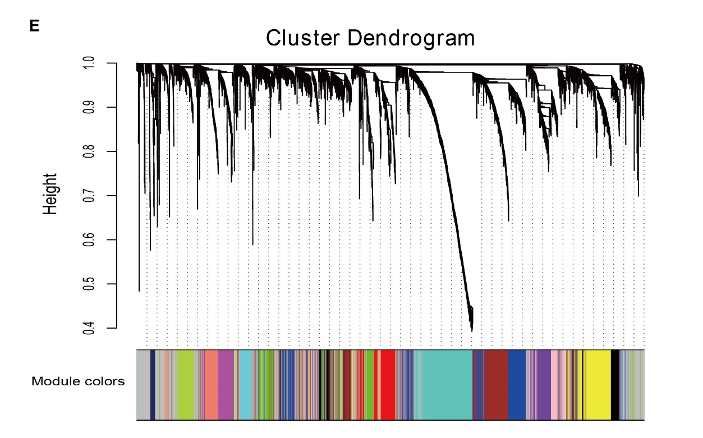

First is a graph of the mean network connectivity between genes with the first figure being my figure and the second being the one the paper reports. Again we a see a similar trend to out outlier analysis. The pattern remains in tact with out scale being wildly different. After that was the WCGNA hub gene analysis, both are titles Cluster Dendogram. The first is my reproduction and the second is the one the paper reports. These two are wildy different and do not report the same genes. Possible reasons for this is that the origional paper does not share its code so I don’t know futher speficications on the settings used. The paper reportes to have have isolated 16 modules from the Cluster Dendrogram above however they do not mention any of them other than cluster yellow. They also do not mention how these 16 clusters were chosen and they link to the above figure in lue of an explination. With this I was unable to replicate the moduels selected by the WCGNA package. 

### 4.3 Replication of given prediction algorithm

In the paper they give a simple algorithm for there prediction model. The Regression Model was trained on the hub genes obtained from the WCGNA Hub Gene Analysis. Their prediction model results in the separation of high and low risk cases. This is performed by a Lasso Cox regression model using the R package glmnet. What the Lasso regression was trained to predict is not entirely clear. The main paper does not explicitly state however the figures provide in the main paper show the Risk Score groups derived from this Lasso regression being plotted on a Overall Survival Kaplan Myer Survival Analysis with the time scale being months lived. The paper states the formula used to get Risk Score that was derived from the Lasso Regression is below. 
 RiskScore = (0.0292 * ExpressionFOXL2NB ) + ( 0.0381 * EpressionPCOLCE2) + (-0.0031 * ExpressionSPINK6) + (0.0497 * ExpressionULBP2) + (-0.054 * ExpressionKCNJI8) + (-0.2872 * ExpressionRFPLI)

Using this formula I tried to replicate the Kaplan-Meier Survival Analysis using the python package lifelines. Some resolved issues that should be noted is a change in gene name. FOXL2 is listed in the data set as C3orf72 so code and dataset management use C3ord72.This are the same genes being used in the prediction, but the data set has them listed under different names. All gene names and gene aliases are sourced from genecards.org, a sight run by the Weizmann Institute of Science and LifeMap Sciences.

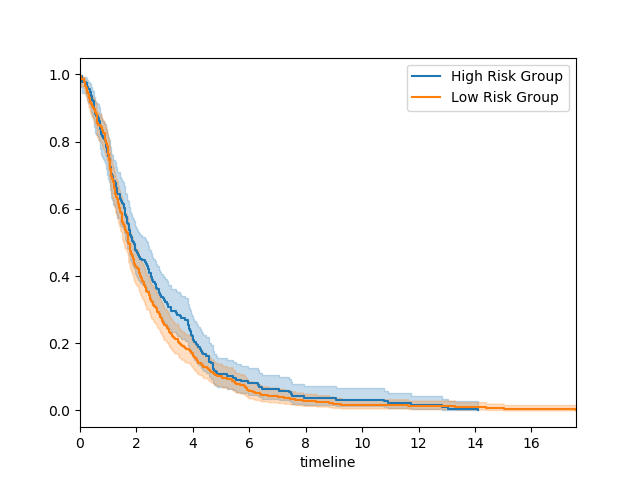

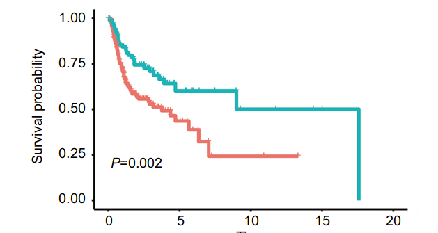  
The first figure is the survival analysis I produced and the second is the survival analysis the paper reports. Although the two groups are distinct we weren’t able to replicate the survival analysis. A potential reason for this is possibly the same reason why out WCGNA Hub Gene analysis failed. A majority of our replicated data although it did have similar patters to the data reported by the paper our data always had a vastly different sense of scale comparatively. A second possible reason is that the data set under the cBioPortal changed. Although the patient ID are matching and the data is sourced from the same location, PanCancerAtlas, the data itself could have been updated.  A third potential reason is my use of python instead of the glmet package. The statistical method preformed is the same in both packages but still could be a potential source of error. 
